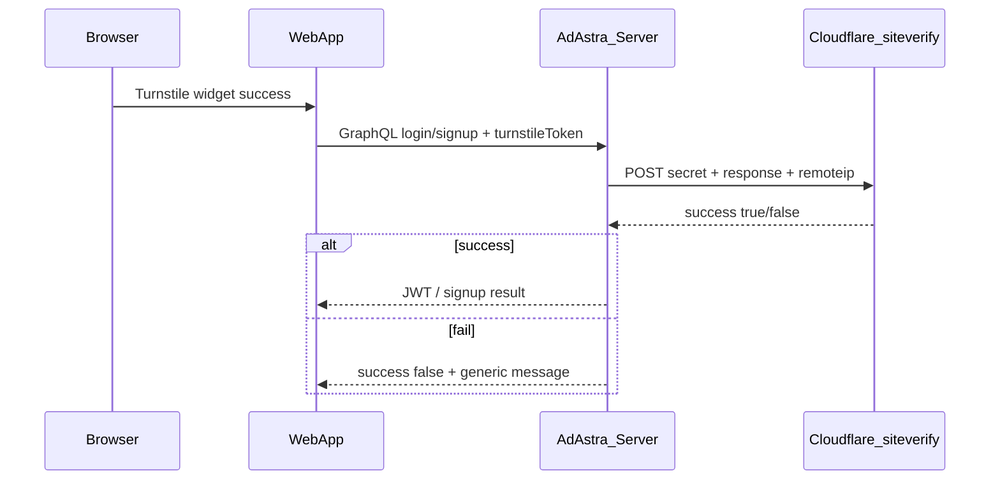

# Backend Cloudflare Turnstile (auth flows)

## Current state

| Layer | Status |
|-------|--------|
| **Frontend** | Sends `turnstileToken` on `login`, `signup`, `requestMagicLink`, `loginWithMagicLink` ([`AdAstra_Web/src/Auth/api.ts`](c:\Users\Sachin\Documents\work\AdAstra_Web\src\Auth\api.ts)). Widget enabled when `VITE_TURNSTILE_SITE_KEY` is set. |
| **Backend** | No Turnstile code. GraphQL only exposes `recaptchaToken` ([`schema.ts`](c:\Users\Sachin\Documents\work\AdAstra_Server\src\graphql\schema.ts) lines 228–243). Mutations with unknown `turnstileToken` will fail GraphQL validation once the site key is enabled in production. |
| **Dashboard gate** | Client-only (`sessionStorage` in [`turnstileSession.ts`](c:\Users\Sachin\Documents\work\AdAstra_Web\src\Auth\turnstileSession.ts)). Per your choice: **no server-side dashboard session** in this task—post-login API abuse is mitigated by blocking unauthenticated bots at signup/login. |

Existing reCAPTCHA is the template: [`recaptchaService.ts`](c:\Users\Sachin\Documents\work\AdAstra_Server\src\services\recaptchaService.ts) + `assertRecaptchaIfConfigured` in [`authService.ts`](c:\Users\Sachin\Documents\work\AdAstra_Server\src\services\authService.ts).



## Security note (secrets)

You shared the **secret key** in chat. Store it only as `TURNSTILE_SECRET_KEY` in server `.env` / deployment secrets—**never commit**. Consider rotating the key in the Cloudflare dashboard since it was exposed in plaintext.

The **site key** is public; set `VITE_TURNSTILE_SITE_KEY=0x4AAAAAACxp3PNOvS-yhlun` in the web app env (already documented in [`.env.example`](c:\Users\Sachin\Documents\work\AdAstra_Web\.env.example)).

## Implementation

### 1. Environment config

In [`src/config/env.ts`](c:\Users\Sachin\Documents\work\AdAstra_Server\src\config\env.ts):

- Add `getTurnstileSecret(): string | undefined` reading `TURNSTILE_SECRET_KEY` (trimmed, empty → undefined).

In [`.env.example`](c:\Users\Sachin\Documents\work\AdAstra_Server\.env.example):

```env
# Cloudflare Turnstile secret. When set, login/signup/magic-link require turnstileToken from the web app.
# Frontend: VITE_TURNSTILE_SITE_KEY (same widget registration).
# TURNSTILE_SECRET_KEY=
```

**Behavior:** If `TURNSTILE_SECRET_KEY` is unset, auth behaves as today (no Turnstile required)—same opt-in model as `RECAPTCHA_SECRET_KEY`.

### 2. `turnstileService.ts`

New file [`src/services/turnstileService.ts`](c:\Users\Sachin\Documents\work\AdAstra_Server\src\services\turnstileService.ts), parallel to reCAPTCHA:

- `verifyTurnstileToken(token, remoteIp?)` → POST `https://challenges.cloudflare.com/turnstile/v0/siteverify` with `application/x-www-form-urlencoded` body: `secret`, `response`, optional `remoteip`.
- `assertTurnstileIfConfigured(token, remoteIp?)` → `{ ok: true }` or `{ ok: false, message: '...' }` with the same user-facing messages as reCAPTCHA (“Human verification required…”, “Verification failed…”).
- Require non-empty token when secret is set (same `length < 20` guard as reCAPTCHA for obviously invalid submissions).

### 3. Combined gate in `authService.ts`

Add a small helper (same file or `humanVerificationService.ts`):

```ts
async function assertHumanVerificationIfConfigured(
  recaptchaToken?: string | null,
  turnstileToken?: string | null,
  remoteIp?: string | null
)
```

Run **both** gates when configured (AND): reCAPTCHA first, then Turnstile. This allows running only Turnstile, only reCAPTCHA, or both without breaking either.

Update signatures and call sites:

- `login(..., recaptchaToken, turnstileToken, remoteIp?)`
- `signup(..., recaptchaToken, turnstileToken, clientIp?)`
- `requestMagicLink(..., recaptchaToken, turnstileToken, remoteIp?)`
- `loginWithMagicLink(..., recaptchaToken, turnstileToken, remoteIp?)`

Pass `getClientIp(context.request)` from GraphQL resolvers where IP is not already passed (login / magic-link mutations).

### 4. GraphQL schema and resolvers

In [`src/graphql/schema.ts`](c:\Users\Sachin\Documents\work\AdAstra_Server\src\graphql\schema.ts):

| Change | Detail |
|--------|--------|
| `SignUpInput` | Add `turnstileToken: String` |
| `login` | Add `turnstileToken: String` |
| `requestMagicLink` | Add `turnstileToken: String` |
| `loginWithMagicLink` | Add `turnstileToken: String` |

Resolvers: extract `turnstileToken`, strip it from signup `input` before `signup(rest, …)` (same as `recaptchaToken`), forward to `authService`.

### 5. Unit tests

New [`tests/unit/turnstileService.test.ts`](c:\Users\Sachin\Documents\work\AdAstra_Server\tests\unit\turnstileService.test.ts) — mirror [`recaptchaService.test.ts`](c:\Users\Sachin\Documents\work\AdAstra_Server\tests\unit\recaptchaService.test.ts):

- Secret unset → allow, no `fetch`
- Secret set + empty token → reject
- Secret set + mocked `{ success: true }` → allow
- Secret set + `{ success: false }` → reject

Ensure [`tests/auth-flow.test.ts`](c:\Users\Sachin\Documents\work\AdAstra_Server\tests\auth-flow.test.ts) `beforeAll` also clears `TURNSTILE_SECRET_KEY` (alongside reCAPTCHA) so DB integration tests keep working.

### 6. Deploy checklist

1. Set `TURNSTILE_SECRET_KEY` on the server (staging + production).
2. Set `VITE_TURNSTILE_SITE_KEY` on the web app (you already have the site key).
3. Restart API after env change.
4. Smoke-test: sign-in and sign-up with widget; confirm invalid/missing token returns verification error without creating users or issuing JWTs.

### Out of scope (per your choice)

- `verifyTurnstile` mutation and enforcing Turnstile on authenticated `ask` / `/api/chat/ask-stream` / other dashboard GraphQL.
- Admin app login (separate app; uses same GraphQL `login`—will need Turnstile widget there too once secret is set, or admin uses an env without the secret).

## Files to touch

| File | Action |
|------|--------|
| [`src/services/turnstileService.ts`](c:\Users\Sachin\Documents\work\AdAstra_Server\src\services\turnstileService.ts) | Create |
| [`src/config/env.ts`](c:\Users\Sachin\Documents\work\AdAstra_Server\src\config\env.ts) | Add getter |
| [`src/services/authService.ts`](c:\Users\Sachin\Documents\work\AdAstra_Server\src\services\authService.ts) | Wire combined gate |
| [`src/graphql/schema.ts`](c:\Users\Sachin\Documents\work\AdAstra_Server\src\graphql\schema.ts) | Schema + resolvers |
| [`.env.example`](c:\Users\Sachin\Documents\work\AdAstra_Server\.env.example) | Document env var |
| [`tests/unit/turnstileService.test.ts`](c:\Users\Sachin\Documents\work\AdAstra_Server\tests\unit\turnstileService.test.ts) | Create |
| [`tests/auth-flow.test.ts`](c:\Users\Sachin\Documents\work\AdAstra_Server\tests\auth-flow.test.ts) | Clear Turnstile env in setup |

No frontend code changes required for this scope.
