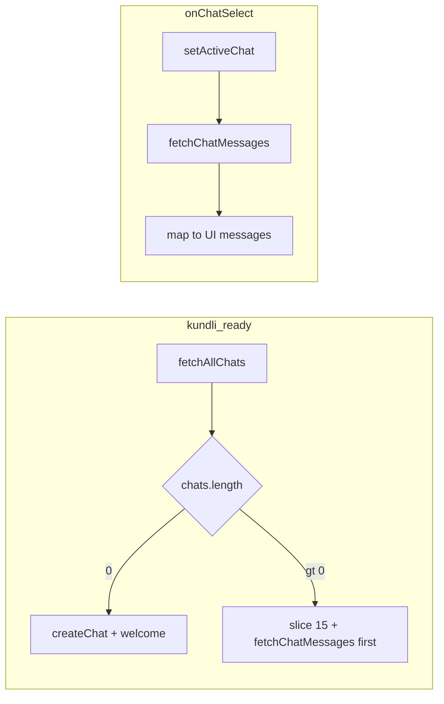

# Chat list, sidebar refactor, and history switching

## Current gaps

- `[ChatSection.tsx](c:\Users\Sachin\Documents\work\AdAstra_Web\src\pages\chat-interface\ChatSection.tsx)` keeps `chats` in local state and only appends the thread created in the `kundliReady` effect; it never calls `[fetchAllChats](c:\Users\Sachin\Documents\work\AdAstra_Web\src\pages\chat-interface\chatAPI.ts)` / `[fetchChatMessages](c:\Users\Sachin\Documents\work\AdAstra_Web\src\pages\chat-interface\chatAPI.ts)`.
- Selecting a chat only updates `activeChat`; `messages` stay in-memory for the previous thread, so the main area does not reflect the chosen `chat_id`.
- The backend already orders chats by `created_at` descending and messages ascending within a thread (`[schema.ts` chats / chatMessages resolvers](C:\Users\Sachin\Documents\work\AdAstra_Server\src\graphql\schema.ts)); no server change is **required** for correctness. Optionally add `take: 15` in `findMany` later for efficiency.

## Data model and mapping

**Sidebar rows (10–15 items):** After `fetchAllChats()`, slice to **15** entries (`.slice(0, 15)`). The GraphQL `Chat` type exposes `id`, `name`, `created_at` (no last-message preview field). Map each row to the existing `[ChatHistory](c:\Users\Sachin\Documents\work\AdAstra_Web\src\pages\chat-interface\ChatSidebar.tsx)` shape:

- **Title:** `name` trimmed, or a default such as `Conversation`.
- **Timestamp:** format `created_at` with a small helper (no `date-fns` in the project—use `Intl.DateTimeFormat` and/or `Intl.RelativeTimeFormat` for “Mar 30” / “3 days ago”).
- **Snippet line:** use a short placeholder (e.g. `Tap to continue` or `—`) unless you add a server field later; optionally refine the active row’s snippet after messages load from the last Q/A pair.

**Messages when opening a chat:** `fetchChatMessages(chatId)` returns rows `{ question, ai_answer, created_at }`. Expand each row into two UI messages (user then AI) with timestamps derived from `created_at` (same string for both or formatted once). If the array is empty, keep the existing welcome AI-only message so the thread is not blank.

**Initial load when kundli is ready (important):**

1. Call `fetchAllChats()`.
2. If **length > 0:** set `chats` from the sliced list, set `activeChat` to the first id (most recent), `fetchChatMessages` for that id, map to `messages`, set `chatCreationDone` without calling `createChat`.
3. If **length === 0:** keep current behavior: `createChat()`, seed `chats` and `messages` as today.

This avoids creating a redundant new thread every time a user with existing history opens chat.

## Switching conversations

- On list item click (existing `onChatSelect`): `setActiveChat(chatId)`, cancel/clear streaming UI (`streamingMessageId`, `isTyping` as appropriate), then **async** load `fetchChatMessages(chatId)` and replace `messages`.
- Add a **loading** flag for history fetch (e.g. `historyLoading`) so the main area can show a compact spinner or skeleton and avoid double-submits while loading.
- On mobile, keep closing the drawer after select (existing behavior).

**Unsaved in-flight send:** If the user is mid-request, either block switch until done or abort—simplest is **disable** chat list items while `isTyping` / streaming (or show confirm)—pick the minimal rule: disable row clicks while `isTyping || streamingMessageId` to avoid inconsistent state.

## Refactor: left column component

Extract the block at `[ChatSection.tsx` ~384–436](c:\Users\Sachin\Documents\work\AdAstra_Web\src\pages\chat-interface\ChatSection.tsx) (overlay is separate; only the fixed sidebar `div` + rail + `ChatSidebar`) into something like `**ChatLeftSidebarLayout.tsx`** next to `[ChatSidebar.tsx](c:\Users\Sachin\Documents\work\AdAstra_Web\src\pages\chat-interface\ChatSidebar.tsx)`:

- Props: `sidebarRef`, `isSidebarOpen`, `setIsSidebarOpen`, `handleNewChat`, and the same props currently passed to `ChatSidebar` (`chats`, `activeChatId`, `onChatSelect`, `onClose`).
- Preserve class names and behavior (collapse rail, width transitions).

`[ChatSidebar](c:\Users\Sachin\Documents\work\AdAstra_Web\src\pages\chat-interface\ChatSidebar.tsx)` remains the inner “Conversations” + list UI; optionally trim redundant outer `w-80` / `h-screen` if it fights the parent `md:w-56`—only if layout visibly breaks.

## Refactor: main chat area component

Extract `[ChatSection.tsx` ~438–648](c:\Users\Sachin\Documents\work\AdAstra_Web\src\pages\chat-interface\ChatSection.tsx) into `**ChatMainArea.tsx`** (or `ChatConversationPanel.tsx`):

- Move **presentational** pieces: header, message list + markdown/typing rows, quick questions, input + mic + send, footer line.
- Pass in props: `messages`, `streamingMessageId`, `isTyping`, `askElapsedSec`, `askWaitMessage` (or import the helper inside the child), `inputText`, `setInputText`, `handleSendMessage`, `handleKeyDown`, speech props, `quickQuestions`, `historyLoading`, etc.
- Keep `[askWaitMessage](c:\Users\Sachin\Documents\work\AdAstra_Web\src\pages\chat-interface\ChatSection.tsx)` / `formatAskElapsed` in a tiny shared module (e.g. `chatWaitCopy.ts`) **only if** both parent and child need them; otherwise define once in the child.

## Wiring after send / new chat

- `**handleNewChat`:** After success, prepend to `chats` and reset `messages` as today; ensure new chat appears at top (already `[newChat, ...prev]`).
- `**handleSendMessage`:** When a turn completes, optionally update the active chat’s sidebar row (snippet + “Now” / relative time) so the list stays realistic without refetching the full list every time.

## Tests and mocks

Update `[ChatSection.test.tsx](c:\Users\Sachin\Documents\work\AdAstra_Web\src\pages\chat-interface\ChatSection.test.tsx)`: mock `fetchAllChats` and `fetchChatMessages` from `chat-interface/chatAPI` (or re-export them through `UserData` if you prefer a single mock surface). Adjust the “ready” test path so it reflects **load existing chats** vs **create when empty**.

## Files to touch (concise)

| Area                  | File                                                                                                                                              |
| --------------------- | ------------------------------------------------------------------------------------------------------------------------------------------------- |
| Orchestration + hooks | `[ChatSection.tsx](c:\Users\Sachin\Documents\work\AdAstra_Web\src\pages\chat-interface\ChatSection.tsx)`                                          |
| New layout wrapper    | `ChatLeftSidebarLayout.tsx` (new)                                                                                                                 |
| New main column       | `ChatMainArea.tsx` (new)                                                                                                                          |
| Optional tiny util    | `chatDateFormat.ts` or colocate helper in `ChatSection`                                                                                           |
| API                   | `[chatAPI.ts](c:\Users\Sachin\Documents\work\AdAstra_Web\src\pages\chat-interface\chatAPI.ts)` — use as-is; no change unless you extend the query |
| Tests                 | `[ChatSection.test.tsx](c:\Users\Sachin\Documents\work\AdAstra_Web\src\pages\chat-interface\ChatSection.test.tsx)`                                |

